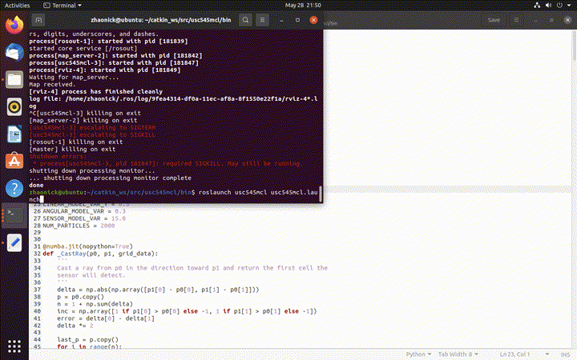

## CSCI545 Lab2: Particle Filter Localization

# Features
- Lidar and Odometry readings simulated through bag file
- improved sensor model accounting for 4 possible scenarios
  - gaussian distribution for correct detection
  - curbed exponential distribution for unexpected object blocking view
  - binomial distribution for noisy max output
  - uniform distribution for noisy random output
- use kmeans mode center as estimate to prevent averaging particles giving unrealistic results

# Setup
- place the `usc545mcl` folder in catkin workspace and make

# Run
`roslaunch usc545mcl usc545mcl.launch`
- red dots are lidar hits
- blue dots are estimated robot position particles
